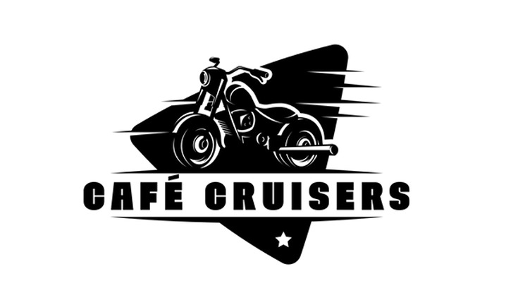

# Cruiserverse - Adventure Community Platform



A comprehensive digital ecosystem built for the adventure community, connecting motorcycle enthusiasts, riders, and adventure seekers worldwide. Cruiserverse serves as a unified platform showcasing multiple business verticals including adventure ventures, core experiences, digital pulse services, strategic partnerships, company culture, creative studio, and career opportunities.

## 🌟 About Cruiserverse

Cruiserverse is more than just a platform—it's a movement that brings together passionate adventurers, innovative services, and cutting-edge technology. Our mission is to create authentic connections through strategic storytelling, community building, and digital innovation in the adventure mobility space.

### Vision
Built for the Wild. Powered by Stories. Driven by Community.

### Mission
To revolutionize how adventure enthusiasts connect, share experiences, and access services while fostering a thriving community ecosystem.

## 🚀 Features

### Core Platform Features
- **Multi-Vertical Integration**: Seamlessly integrated business verticals under one roof
- **Adventure-Focused Design**: Tailored UI/UX for the adventure community
- **Real-time Interactions**: Dynamic content and user engagement features
- **Mobile-First Approach**: Optimized for on-the-go adventure enthusiasts
- **Community Building**: Tools and features that foster community connections

### Technical Features
- **Modern Architecture**: Built with Next.js 14, React 18, and TypeScript
- **Responsive Design**: Mobile-first design with Tailwind CSS
- **Static Export Ready**: Configured for static site generation and deployment
- **Smooth Animations**: Enhanced user experience with Framer Motion
- **External API Integration**: Seamless form submissions to external endpoints
- **SEO Optimized**: Built-in SEO with Next.js metadata API and sitemap generation
- **Performance Optimized**: Image optimization, compression, and advanced caching
- **Accessibility Focused**: WCAG compliant with Radix UI primitives

## 🛠 Tech Stack

### Frontend
- **Framework**: Next.js 14 (App Router)
- **Language**: TypeScript 5.x
- **Styling**: Tailwind CSS 3.x
- **Animations**: Framer Motion
- **Icons**: Lucide React
- **UI Components**: Radix UI primitives

### Development & Build Tools
- **Package Manager**: npm
- **Linting**: ESLint with custom configuration
- **Code Formatting**: Prettier
- **Form Handling**: React Hook Form
- **Validation**: Zod resolvers
- **Build Output**: Static Export & Server-side options

### Deployment & Hosting
- **Static Hosting**: Netlify, Vercel, GitHub Pages compatible
- **Server Hosting**: cPanel Node.js support
- **CDN**: Optimized for global content delivery
- **SSL**: HTTPS ready with automatic redirects

## 📁 Project Structure

```
cafe/
├── public/                 # Static assets
│   ├── assets/            # Images and media files
│   └── base/              # Brand assets and logos
├── src/
│   ├── app/               # Next.js app directory
│   │   ├── careers/       # Careers page
│   │   ├── core/          # Core services page
│   │   ├── culture/       # Culture page
│   │   ├── partnership/   # Partnership page
│   │   ├── pulse/         # Pulse digital services page
│   │   ├── studio/        # Studio page
│   │   ├── ventures/      # Ventures page
│   │   └── globals.css    # Global styles
│   ├── components/        # Reusable components
│   │   ├── careers/       # Career-specific components
│   │   ├── core/          # Core service components
│   │   ├── culture/       # Culture components
│   │   ├── home/          # Homepage components
│   │   ├── partnership/   # Partnership components
│   │   ├── pulse/         # Pulse service components
│   │   ├── studio/        # Studio components
│   │   ├── ventures/      # Ventures components
│   │   └── ui/            # Base UI components
│   ├── hooks/             # Custom React hooks
│   ├── lib/               # Utility libraries
│   └── styles/            # Additional styles
├── server.js              # Custom server for cPanel hosting
├── app.js                 # Alternative startup script
└── .htaccess             # Apache configuration
```

## � Development Workflow

### 1. Project Setup
```bash
# Clone the repository
git clone https://github.com/Rajs2001/cafe.git
cd cafe

# Install dependencies
npm run instldeps

# Set up environment variables
cp .env.example .env.local
```

### 2. Development Process
```bash
# Start development server
npm run dev

# Run linting during development
npm run lint

# Fix linting issues automatically
npm run lint:fix
```

### 3. Testing & Quality Assurance
```bash
# Type checking
npm run build

# Performance testing
npm run dev --turbo

# Code quality check
npm run lint
```

### 4. Build & Deployment
```bash
# Build for production
npm run build

# Create static export
npm run export

# Test production build locally
npm run start
```

### 5. Deployment Options

#### Static Hosting (Recommended)
```bash
# Generate static files
npm run export

# Deploy 'out' directory to:
# - Netlify
# - Vercel
# - GitHub Pages
# - AWS S3
# - Any static host
```

#### Server Hosting (cPanel)
```bash
# Upload project files
# Configure Node.js app in cPanel
# Set startup file: server.js
npm install
npm run server
```

## 📋 Project Workflow

### Feature Development Cycle

1. **Planning Phase**
   - Identify feature requirements
   - Create component structure
   - Plan API integrations

2. **Development Phase**
   - Create reusable components
   - Implement responsive design
   - Add animations and interactions
   - Integrate with external APIs

3. **Testing Phase**
   - Cross-browser testing
   - Mobile responsiveness testing
   - Performance optimization
   - Accessibility compliance

4. **Deployment Phase**
   - Static export generation
   - CDN optimization
   - SEO validation
   - Production deployment

### Code Organization Standards

- **Component Structure**: Modular, reusable components
- **TypeScript**: Strict type checking enabled
- **Responsive Design**: Mobile-first approach
- **Performance**: Optimized loading and rendering
- **Accessibility**: WCAG 2.1 AA compliance
- **SEO**: Structured data and meta optimization

## 🚀 Getting Started

### Prerequisites

- **Node.js**: 18.x or higher (LTS recommended)
- **npm**: 8.x or higher
- **Git**: Latest version
- **Modern Browser**: Chrome, Firefox, Safari, or Edge

### Quick Start

1. **Clone and Setup**
   ```bash
   git clone https://github.com/Rajs2001/cafe.git
   cd cafe
   npm run instldeps
   ```

2. **Environment Configuration**

   Create a `.env.local` file:
   ```env
   # Application Settings
   NEXT_PUBLIC_SITE_URL=http://localhost:3000
   NEXT_PUBLIC_API_BASE_URL=https://api.cruiserverse.in

   # External API Configuration
   NEXT_PUBLIC_EMAIL_API_ENDPOINT=https://api.cruiserverse.in/v1/email
   ```

3. **Start Development**
   ```bash
   npm run dev
   ```

4. **Open Application**

   Navigate to [http://localhost:3000](http://localhost:3000) to view the application.

### Development Setup

For a complete development environment:

```bash
# Install all dependencies
npm install

# Run type checking
npx tsc --noEmit

# Run linting
npm run lint

# Start development with turbo mode
npm run dev --turbo
```

## 📦 Available Scripts

### Development Scripts
- `npm run dev` - Start development server with hot reload
- `npm run instldeps` - Install dependencies with legacy peer deps support
- `npm run lint` - Run ESLint for code quality checks
- `npm run lint:fix` - Automatically fix ESLint issues

### Production Scripts
- `npm run build` - Build application for production
- `npm run start` - Start production server
- `npm run export` - Generate static export (recommended for deployment)
- `npm run server` - Start custom server (for cPanel hosting)

### Additional Scripts
- `npm run type-check` - Run TypeScript type checking
- `npm run analyze` - Analyze bundle size and dependencies
- `npm run clean` - Clean build artifacts and cache

## 🌐 Deployment

### Static Export (Recommended)

The application is configured for static export, making it suitable for deployment on any static hosting service.

1. **Build the static site**
   ```bash
   npm run export
   ```

2. **Deploy the `out` directory**

   The generated `out` directory contains all static files ready for deployment to:
   - Netlify
   - Vercel
   - GitHub Pages
   - AWS S3
   - Any web server

### cPanel Hosting

For cPanel hosting with Node.js support:

1. Upload project files to cPanel
2. Configure Node.js app in cPanel
3. Set startup file to `server.js`
4. Install dependencies with `npm install`

See [DEPLOYMENT.md](DEPLOYMENT.md) for detailed cPanel deployment instructions.

## 🎨 Pages & Features

### 🏠 Homepage
- **Hero Section**: Dynamic hero with animated background and call-to-action
- **Service Overview**: Interactive cards showcasing all business verticals
- **Community Highlights**: Featured stories and testimonials
- **Quick Navigation**: Seamless routing to all platform sections

### 🏔️ Ventures
- **Adventure Showcase**: Curated adventure experiences and destinations
- **Community Hub**: Connect with fellow adventure enthusiasts
- **Team Introductions**: Meet the passionate team behind the adventures
- **Experience Galleries**: Visual storytelling of epic journeys
- **Interactive Maps**: Explore adventure locations and routes

### ⚙️ Core
- **Service Portfolio**: Comprehensive overview of core offerings
- **Feature Highlights**: Interactive demonstrations of key capabilities
- **Technical Expertise**: Showcase of technical skills and solutions
- **Innovation Lab**: Latest developments and breakthrough technologies
- **Client Success Stories**: Real-world impact and testimonials

### 📡 Pulse
- **Digital Marketing Hub**: Comprehensive digital marketing services
- **Brand Storytelling**: Strategic content and narrative development
- **Analytics Dashboard**: Performance metrics and insights
- **Campaign Management**: End-to-end marketing campaign solutions
- **Social Media Integration**: Multi-platform social media management

### 🤝 Partnership
- **Collaboration Opportunities**: Strategic partnership programs
- **Contact Integration**: Advanced contact form with external API
- **Business Development**: B2B collaboration and growth strategies
- **Alliance Network**: Partner ecosystem and relationship management
- **Investment Opportunities**: Funding and investment information

### 🎭 Culture
- **Company Values**: Deep dive into organizational culture and values
- **Team Stories**: Personal journeys and professional growth stories
- **Work Environment**: Behind-the-scenes look at company culture
- **Employee Benefits**: Comprehensive benefits and perks overview
- **Community Impact**: Social responsibility and community initiatives

### 🎬 Studio
- **Creative Portfolio**: Showcase of creative work and projects
- **Content Creation**: End-to-end content production services
- **Video Production**: Professional video creation and editing
- **Photography Services**: Adventure and commercial photography
- **Creative Process**: Insight into the creative development workflow

### 💼 Careers
- **Job Opportunities**: Current openings across all departments
- **Company Benefits**: Comprehensive benefits package details
- **Application Process**: Streamlined application and hiring workflow
- **Team Growth**: Employee development and advancement opportunities
- **Work Culture**: Day-in-the-life content and employee testimonials

## 🔧 Configuration

### Next.js Configuration (`next.config.mjs`)

The application uses advanced Next.js configuration optimized for performance and deployment:

```javascript
{
  // Static export for universal deployment
  output: 'export',

  // Image optimization for static hosting
  images: { unoptimized: true },

  // CORS headers for external API integration
  headers: [
    {
      source: '/(.*)',
      headers: [
        { key: 'Access-Control-Allow-Origin', value: 'https://api.cruiserverse.in' }
      ]
    }
  ],

  // Build optimization
  eslint: { ignoreDuringBuilds: true },
  typescript: { ignoreBuildErrors: true }
}
```

### External API Integration

The platform integrates with external APIs for enhanced functionality:

#### Contact Form API
- **Endpoint**: `https://api.cruiserverse.in/v1/email`
- **Method**: POST
- **Content-Type**: application/json
- **CORS**: Configured for cross-origin requests

**Request Body Structure**:
```json
{
  "name": "Full Name",
  "contact": "1234567890",
  "email": "user@example.com",
  "purpose": "Contact purpose",
  "business": "Business name",
  "message": "Detailed message"
}
```

### Styling Architecture

#### Tailwind CSS Configuration
- **Design System**: Custom color palette and typography
- **Responsive Breakpoints**: Mobile-first approach
- **Custom Components**: Reusable utility classes
- **Dark Mode**: Automatic theme switching capabilities

#### Component Library
- **Base Components**: Radix UI primitives for accessibility
- **Custom Components**: Adventure-themed UI elements
- **Animation Library**: Framer Motion for smooth interactions
- **Icon System**: Lucide React for consistent iconography

### Environment Variables

```env
# Application Configuration
NEXT_PUBLIC_SITE_URL=https://cruiserverse.in
NEXT_PUBLIC_API_BASE_URL=https://api.cruiserverse.in

# External API Endpoints
NEXT_PUBLIC_EMAIL_API_ENDPOINT=https://api.cruiserverse.in/v1/email

# Feature Flags
NEXT_PUBLIC_ENABLE_ANALYTICS=true
NEXT_PUBLIC_ENABLE_PWA=true
```

## 🎯 SEO & Performance

### Search Engine Optimization
- **Metadata API**: Next.js 14 metadata for comprehensive SEO
- **Structured Data**: JSON-LD schema markup for rich snippets
- **Sitemap Generation**: Automatic XML sitemap creation
- **Open Graph**: Social media optimization for all pages
- **Canonical URLs**: Proper URL canonicalization

### Performance Optimization
- **Static Generation**: Pre-rendered pages for lightning-fast loading
- **Image Optimization**: WebP format with lazy loading
- **Code Splitting**: Automatic bundle optimization
- **Compression**: Gzip/Brotli compression enabled
- **Caching Strategy**: Advanced browser and CDN caching
- **Core Web Vitals**: Optimized for Google's performance metrics

### Accessibility Features
- **WCAG 2.1 AA**: Compliant with accessibility standards
- **Keyboard Navigation**: Full keyboard accessibility support
- **Screen Reader**: Optimized for assistive technologies
- **Color Contrast**: High contrast ratios for better readability
- **Focus Management**: Proper focus indicators and management

### Analytics & Monitoring
- **Performance Tracking**: Real-time performance monitoring
- **User Experience**: Comprehensive UX analytics
- **Error Tracking**: Automatic error detection and reporting
- **Speed Insights**: Page speed optimization insights

## 🤝 Contributing

We welcome contributions from the adventure community! Here's how you can get involved:

### Getting Started
1. **Fork the Repository**
   ```bash
   git fork https://github.com/Rajs2001/cafe.git
   ```

2. **Create Feature Branch**
   ```bash
   git checkout -b feature/amazing-adventure-feature
   ```

3. **Follow Development Standards**
   - Write clean, documented code
   - Follow TypeScript best practices
   - Maintain responsive design principles
   - Include proper accessibility features

4. **Test Your Changes**
   ```bash
   npm run lint
   npm run build
   npm run export
   ```

5. **Submit Pull Request**
   ```bash
   git commit -m 'Add amazing adventure feature'
   git push origin feature/amazing-adventure-feature
   ```

### Contribution Guidelines
- **Code Style**: Follow ESLint and Prettier configurations
- **Component Structure**: Use modular, reusable components
- **Documentation**: Update README and inline documentation
- **Testing**: Ensure cross-browser compatibility
- **Performance**: Maintain optimal loading speeds

### Areas for Contribution
- **UI/UX Improvements**: Enhanced user experience features
- **Performance Optimization**: Speed and efficiency improvements
- **Accessibility**: Better accessibility compliance
- **Mobile Experience**: Enhanced mobile responsiveness
- **New Features**: Adventure-focused functionality

## 📝 License

This project is licensed under the MIT License - see the [LICENSE](LICENSE) file for details.

### Open Source Components
This project uses various open-source libraries and frameworks. We acknowledge and thank the open-source community for their contributions.

## 📞 Contact & Support

### Primary Contact
- **Website**: [https://cruiserverse.in](https://cruiserverse.in)
- **Email**: services@cruiserverse.in

### Business Inquiries
- **Partnerships**: partnerships@cruiserverse.in
- **Careers**: careers@cruiserverse.in
- **Media**: media@cruiserverse.in

### Technical Support
- **Issues**: Create an issue on GitHub
- **Documentation**: Comprehensive docs available
- **Community**: Join our adventure community discussions

## 🙏 Acknowledgments

### Community & Contributors
- Built with ❤️ for the global adventure community
- Thanks to all contributors and the open-source community
- Special appreciation to motorcycle and adventure enthusiasts worldwide
- Gratitude to the Next.js and React communities for excellent frameworks

### Technology Partners
- **Vercel**: For exceptional deployment platform
- **Tailwind CSS**: For utility-first CSS framework
- **Framer Motion**: For smooth animation capabilities
- **Radix UI**: For accessible component primitives

---

**Built for the Wild. Powered by Stories. Driven by Community.**

*Adventure awaits - join the Cruiserverse community today!*
